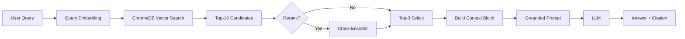

# Architecture — RAG Pipeline (Day 08 Lab)

> Sprint 4 deliverable (Person 5): mô tả kiến trúc end-to-end, config chính,
> và tình trạng evaluation hiện tại của pipeline.

## 1. Tổng quan kiến trúc

```
[Raw Docs]
    ↓
[index.py: Preprocess → Chunk → Embed → Store]
    ↓
[ChromaDB Vector Store]
    ↓
[rag_answer.py: Query → Retrieve → Rerank → Generate]
    ↓
[Grounded Answer + Citation]
```

**Mô tả ngắn gọn:**
Nhóm xây một trợ lý nội bộ cho khối CS + IT Helpdesk để trả lời câu hỏi nghiệp vụ dựa trên tài liệu chính sách nội bộ.
Pipeline dùng RAG: index tài liệu vào ChromaDB, retrieve top chunks theo query, rồi sinh câu trả lời có citation.
Mục tiêu chính là giảm hallucination và bắt buộc answer phải grounded theo context retrieve được.

---

## 2. Indexing Pipeline (Sprint 1)

### Tài liệu được index
| File | Nguồn | Department | Số chunk |
|------|-------|-----------|---------|
| `policy_refund_v4.txt` | `policy/refund-v4.pdf` | CS | 2 |
| `sla_p1_2026.txt` | `support/sla-p1-2026.pdf` | IT | 2 |
| `access_control_sop.txt` | `it/access-control-sop.md` | IT Security | 2 |
| `it_helpdesk_faq.txt` | `support/helpdesk-faq.md` | IT | 2 |
| `hr_leave_policy.txt` | `hr/leave-policy-2026.pdf` | HR | 2 |

### Quyết định chunking
| Tham số | Giá trị | Lý do |
|---------|---------|-------|
| Chunk size | 400 tokens (xấp xỉ `CHUNK_SIZE * 4` ký tự) | Cân bằng giữa giữ ngữ cảnh và giới hạn context window |
| Overlap | 80 tokens (xấp xỉ `CHUNK_OVERLAP * 4` ký tự) | Giảm mất mạch thông tin khi section bị chia chunk |
| Chunking strategy | Heading-based + paragraph-aware split + overlap | Ưu tiên cắt theo ranh giới tự nhiên trước khi fallback theo độ dài |
| Metadata fields | `source`, `section`, `effective_date`, `department`, `access`, `doc_type` | Phục vụ retrieval, citation, kiểm tra freshness, và phân tích coverage |

### Embedding model
- **Model**: `text-embedding-3-small` (ưu tiên nếu có `OPENAI_API_KEY`), fallback `paraphrase-multilingual-MiniLM-L12-v2`
- **Vector store**: ChromaDB (PersistentClient)
- **Similarity metric**: Cosine

---

## 3. Retrieval Pipeline (Sprint 2 + 3)

### Baseline (Sprint 2)
| Tham số | Giá trị |
|---------|---------|
| Strategy | Dense (embedding similarity) |
| Top-k search | 10 |
| Top-k select | 3 |
| Rerank | Không |

### Variant (Sprint 3)
| Tham số | Giá trị | Thay đổi so với baseline |
|---------|---------|------------------------|
| Strategy | `hybrid` (dense + BM25 + RRF) | Dense-only -> hybrid để tăng recall cho keyword/alias query |
| Top-k search | 10 | Giữ nguyên baseline để tách tác động của strategy |
| Top-k select | 3 | Giữ nguyên baseline để ổn định prompt length |
| Rerank | `True` (CrossEncoder `ms-marco-MiniLM-L-6-v2`) | Bổ sung bước lọc noise trước khi generate |
| Query transform | Query expansion (`QUERY_ALIAS_MAP`) | Bổ sung alias/synonym để xử lý tên cũ như "Approval Matrix" |

**Lý do chọn variant này:**
Chọn hybrid vì corpus có cả ngôn ngữ tự nhiên (policy/FAQ) và thuật ngữ/mã lỗi (SLA P1, ERR-*), dense-only dễ hụt exact term.
Rerank được thêm để giảm noise khi search rộng top-10.
Prompt v2 tiếng Việt + few-shot và query expansion được thêm để tăng citation consistency và xử lý alias query.

---

## 4. Generation (Sprint 2)

### Grounded Prompt Template
```
Answer only from the retrieved context below.
If the context is insufficient, say you do not know.
Cite the source field when possible.
Keep your answer short, clear, and factual.

Question: {query}

Context:
[1] {source} | {section} | score={score}
{chunk_text}

[2] ...

Answer:
```

### LLM Configuration
| Tham số | Giá trị |
|---------|---------|
| Model | `gpt-4o-mini` (ưu tiên), fallback `gemini-1.5-flash` |
| Temperature | 0 (để output ổn định cho eval) |
| Max tokens | 512 |

### Generation guardrails
- Evidence-only: chỉ trả lời từ context retrieve được.
- Citation bắt buộc: mọi claim phải kèm nguồn dạng `[1]`, `[2]`.
- Abstain chuẩn: `"Toi khong tim thay thong tin nay trong tai lieu noi bo."` khi thiếu ngữ cảnh.
- Trả lời cùng ngôn ngữ câu hỏi, ưu tiên ngắn gọn và factual.

---

## 5. Failure Mode Checklist

> Dùng khi debug — kiểm tra lần lượt: index → retrieval → generation

| Failure Mode | Triệu chứng | Cách kiểm tra |
|-------------|-------------|---------------|
| Index lỗi | Retrieve về docs cũ / sai version | `inspect_metadata_coverage()` trong index.py |
| Chunking tệ | Chunk cắt giữa điều khoản | `list_chunks()` và đọc text preview |
| Retrieval lỗi | Không tìm được expected source | `score_context_recall()` trong eval.py |
| Generation lỗi | Answer không grounded / bịa | `score_faithfulness()` trong eval.py |
| Token overload | Context quá dài → lost in the middle | Kiểm tra độ dài context_block |

---

## 6. Evaluation Metrics (Sprint 4)

Pipeline eval hiện dùng 4 metric chính trong `eval.py`:
- **Faithfulness (1-5):** câu trả lời có bám context retrieve không.
- **Answer Relevance (1-5):** câu trả lời có đúng trọng tâm câu hỏi không.
- **Context Recall (0-5 scale):** expected source có được retrieve không.
- **Completeness (1-5):** answer có bao phủ đủ ý chính so với expected answer không.

Các chỉ số theo run gần nhất (`logs/grading_run.json`):
- Baseline: faithfulness `1.00`, relevance `1.10`, context recall `0.00`, completeness `1.10`.
- Variant: faithfulness `1.00`, relevance `1.10`, context recall `0.00`, completeness `1.10`.
- Delta: `0.00` cho toàn bộ metric.

Diễn giải:
- A/B chưa phản ánh chất lượng retrieval/generation thật vì run này trả về `0 chunks` cho mọi query.
- Nguyên nhân root-cause trong log: lỗi embedding/retrieval khiến pipeline abstain toàn bộ.
- Hành động bắt buộc trước khi chấm lại: fix embedding, rebuild index, rerun baseline + variant.

---

## 7. Diagram

Sơ đồ dưới đây dùng Mermaid để mô tả luồng retrieval + generation hiện tại.


